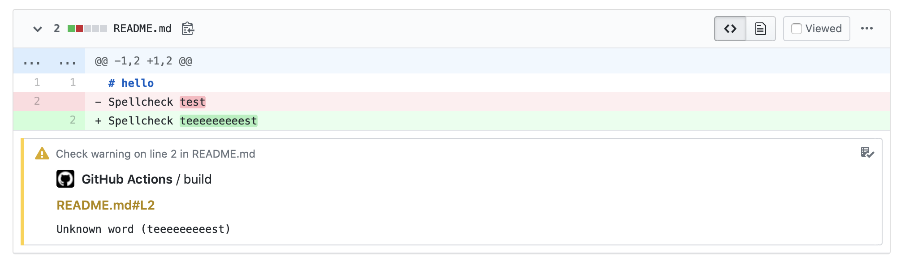

# cspell action 

This action runs [cspell](https://github.com/streetsidesoftware/cspell) to spell-check your code. Unknown words show up as annotations on GitHub.

## Inputs

### `paths`

**Required** A [glob](https://en.wikipedia.org/wiki/Glob_%28programming%29) describing the paths in the repo to spell-check.

### `config`

**Optional** Configuration file to use. For more details, see the [cspell documentation](https://github.com/streetsidesoftware/cspell/tree/master/packages/cspell#customization).

### `exclude`

**Optional** A glob describing paths that would otherwise be checked by `paths` but will instead be ignored.

### `unique`

**Optional** Only warn once for a misspelling. By default, `false`.

## Outputs

None.

## Example usage

```yaml
uses: zwaldowski/cspell-action@v1
with:
  paths: "**/*.{md,js}"
  config: .github/workflows/cspell.json
  exclude: "LICENSE.md"
```


